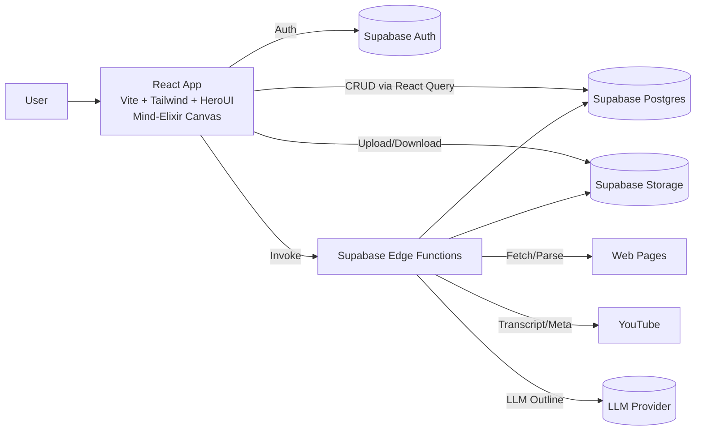
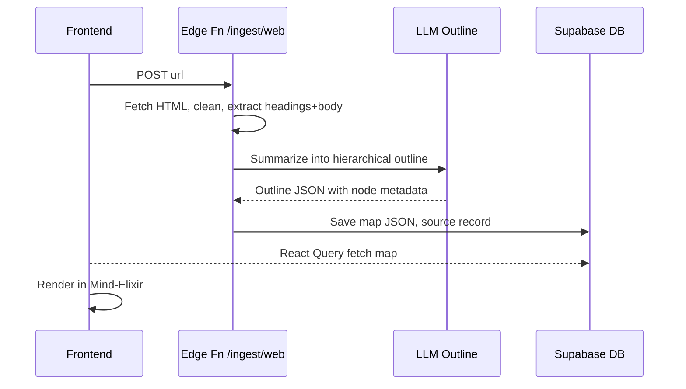

# Architecture — MindCanvas

## Overview
- **Frontend**: React + Vite, Tailwind + HeroUI, Zustand store, React Query, Mind‑Elixir canvas.
- **Backend**: Supabase (Auth, Postgres, Storage, Edge Functions). Edge Functions handle ingestion/extraction and LLM orchestration.
- **External**: LLM provider (pluggable), YouTube APIs, PDF/DOC parsers.

## Diagram

## Frontend Composition
- **Canvas**: Mind‑Elixir instance wrapped in a React component; event bridge to Zustand.
- **State**: 
  - `useAuthStore` (profile, tokens), 
  - `useMapStore` (current map JSON, selection, history), 
  - `useUIStore` (theme, panel state).
- **Data fetching**: React Query with keys like `["map", id]`, `["sources", mapId]`.
- **Routing**: `/`, `/maps/:id`, `/import`, `/settings`.

## Backend (Supabase)
- **Auth**: Email + OAuth, RLS on all tables by `auth.uid()`.
- **Postgres**: store maps as JSONB (simple path). Optionally add `nodes` table for search/analytics.
- **Storage**: original files and generated assets (PNG/SVG exports).
- **Edge Functions** (Deno): 
  - `/ingest/web` — fetch URL, Readability-like extraction
  - `/ingest/youtube` — transcript + timestamps
  - `/ingest/pdf` — pdf text extraction (server or client-fallback)
  - `/ingest/doc` — DOCX to Markdown (e.g., mammoth)
  - `/ai/outline` — chunk + prompt + assemble outline JSON
  - `/export/opml` — convert JSON → OPML

## Key Sequences
### Web URL → Map

### YouTube → Map
- Fetch metadata + transcript (with timestamps)
- Prompt LLM to **segment by topic** and retain timecodes
- Create nodes with `data.timecode` and deeplink to `https://youtu.be/...&t=Xs`

## Security, Privacy, and RLS
- RLS: users read/write only their rows; shared links grant temporary access via **signed policies**.
- Never store raw API keys in DB; use Edge Function secrets.
- Store moderation + source URL for each AI-generated map for auditing.

## Caching & Performance
- Cache extraction results by **content hash** (URL + etag + date) and by file checksum.
- Chunk long text to fit token limits; map-reduce merge pass.
- Canvas: avoid re-render storms by diffing map JSON; batch updates via Zustand.

